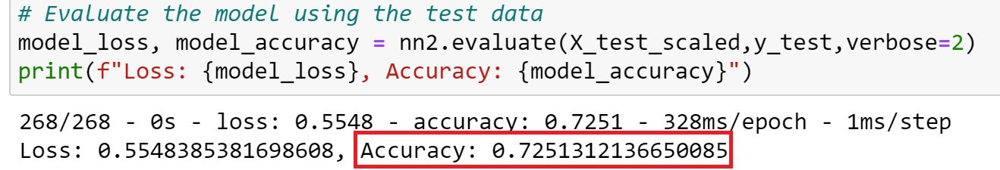
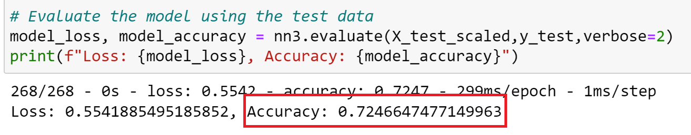
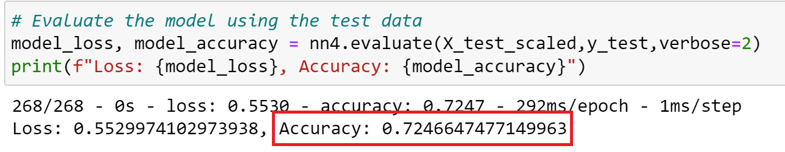

# Neural Network Charity Analysis

## Overview:
Alphabet Soup is a non-profit foundation dedicated to helping organizations that protect the environment and improve the well-being of humanity. Alphabet Soup has raised over 10 billion dollars to invest in various life saving technologies and fund reforestation groups around the world. Not every donation is impactful as some companies take the money and disappear. 

The purpose of this analysis is to assess which companies are worth donating to and which are too high risk. Using a CSV containing more than 34,000 organizations that have received funding from Alphabet Soup over the years, the following analysis uses the features in the dataset to create a binary classifier capable of predicting whether applicants will be successful if funded by Alphabet Soup.

## Results:

### Data Preprocessing
* The 'IS_SUCCESSFUL' column is the target variable for the model
* 'APPLICATION_TYPE', 'AFFILIATION', 'CLASSIFICATION', 'USE_CASE', 'ORGANIZATION', 'STATUS', 'INCOME_AMT', 'SPECIAL_CONSIDERATIONS' and 'ASK_AMT' are the model features
* 'EIN' and 'NAME' are neither targets nor features and were removed from the input data
### Compiling, Training, and Evaluating the Model
* I adjusted a variety of parameters in the neutral network model to assess whether those differences could lead to a higher model performance.
* In the first attempt at increasing model performance I added a third hidden layer to evaluate higher order interactions between weighted variables and identify complex, nonlinear relationships. The following is the accuracy of the previously described model.

* In the second attempt at incresing model performance I increased the number of epochs to 200 to assess if the original number of epochs (100) was too low (if the number of epochs is too low, then the training will stop even before the model converges). The following is the accuracy of the previously described model.

* In the third attempt at increasing model performance I changed the activation function of the hidden layers from relu to tanh to see if it was a better fit for the data. The following is the accuracy of the previously described model.

* None of these attempts at changing the model parameters achieved the target model performance of over 75%.

## Summary: 
Ultimately, the deep learning model was unsuccessful at achieving the target model performance of ove 75%. This model needs more work to meet the standards of Alphabet Soup in order to more accurately predict the companies that will be successful if funded. My recommended next step to enhance the model would be to eliminate some of the features that may be causing confusion within the model. 
